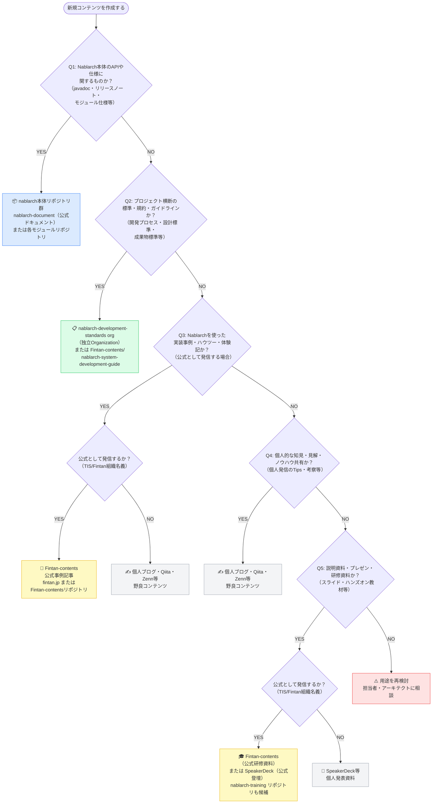

# Nablarch コンテンツ配置先判断フローチャート

## 概要

Nablarch関連コンテンツを新規作成する際の配置先判断ロジックです。
コンテンツの性質（公式API仕様・開発標準・実装事例・個人ノウハウ・研修資料）に応じて、適切なリポジトリ・プラットフォームを選択できます。

調査根拠: [official-content-inventory.md](./official-content-inventory.md)（2026-05-18調査）

---

## フローチャート

---

## 各配置先の説明

### 📦 GitHub: nablarch/nablarch-document（公式ドキュメント）

- **対象**: Nablarchフレームワークの公式機能説明・APIリファレンス・アーキテクチャ解説
- **URL**: https://github.com/nablarch/nablarch-document
- **公開先**: https://nablarch.github.io/docs/LATEST/doc/
- **備考**: Sphinx形式。リリースノートや移行ガイドもここ

### 📦 GitHub: nablarch/{各モジュールリポジトリ}

- **対象**: 特定モジュールのREADME・javadoc・バグ修正・プルリクエスト
- **URL**: https://github.com/nablarch/（例: nablarch-core, nablarch-fw-web, nablarch-common-dao 等）
- **備考**: nablarch GitHub Organization に 120+ リポジトリ存在（2026-05-18時点）

### 📋 GitHub: nablarch-development-standards org（開発標準・規約・コーディングルール）

- **Organization**: https://github.com/nablarch-development-standards
- **nablarch org とは独立した別組織**（親子・傘下関係なし）
- 主要リポジトリ:
  - [nablarch-development-standards](https://github.com/nablarch-development-standards/nablarch-development-standards): 開発プロセス標準・アプリケーション開発標準
  - [nablarch-style-guide](https://github.com/nablarch-development-standards/nablarch-style-guide): スタイルガイド
  - [nablarch-development-standards-tools](https://github.com/nablarch-development-standards/nablarch-development-standards-tools): 開発標準適用支援ツール

### 📋 GitHub: Fintan-contents/nablarch-system-development-guide

- **対象**: 開発開始前・開発中に参照する標準・ガイドライン・プロセス定義
- **URL**: https://github.com/Fintan-contents/nablarch-system-development-guide
- **備考**: サンプルプロジェクト（Web/バッチ/REST）付き。⭐9（2026-05時点）

### 📝 Fintan-contents（公式事例記事 / fintan.jp）

- **対象**: TIS/Fintan組織名義で発信するNablarch実装事例・ハウツー・技術解説
- **URL（記事公開先）**: https://fintan.jp/
- **URL（コンテンツリソース）**: https://github.com/Fintan-contents/nablarch-contents-resources
- **備考**: 画像素材等は nablarch-contents-resources を利用

### 🎓 GitHub: Fintan-contents/nablarch-training（公式研修資料）

- **対象**: 公式として提供するNablarch学習コンテンツ・トレーニング教材
- **URL**: https://github.com/Fintan-contents/nablarch-training
- **備考**: ⭐1（2026-05時点）。新規参画エンジニア向けハンズオン教材

### ✍️ 個人ブログ・Qiita・Zenn等（野良コンテンツ）

- **対象**: 個人の知見・体験談・考察・Tips（組織名義ではない情報発信）
- **プラットフォーム例**:
  - Qiita: https://qiita.com/
  - Zenn: https://zenn.dev/
  - 個人ブログ等
- **備考**: 公式ではないが、コミュニティへの貢献として価値あり

### 🎤 SpeakerDeck等（個人発表資料）

- **対象**: 勉強会・カンファレンス等での個人発表スライド
- **プラットフォーム例**:
  - SpeakerDeck: https://speakerdeck.com/
- **備考**: 公式登壇資料は Fintan-contents または公式 SpeakerDeck アカウントを利用

---

## 判断に迷う場合のチェックリスト

| 確認項目 | YES → | NO → |
|---------|-------|------|
| TIS/Fintan組織名義で発信するか？ | 公式チャネル（nablarch GitHub / Fintan-contents）へ | 個人チャネル（Qiita/Zenn/個人ブログ）へ |
| Nablarch本体コードへの変更を伴うか？ | nablarch GitHub Organization の該当リポジトリへPR | ドキュメント・コンテンツとして配置 |
| 特定バージョン依存の情報か？ | バージョンを明記し nablarch-document へ | バージョン非依存として一般ドキュメントへ |
| 他プロジェクトでも再利用される内容か？ | 開発標準（nablarch-system-development-guide）へ | プロジェクト内ドキュメントとして管理 |

---

## 補足: nablarch-development-standards について

`nablarch-development-standards` は **nablarch org とは独立した別の GitHub Organization**（https://github.com/nablarch-development-standards）として存在する。親子・傘下関係はない。

なお、`nablarch/nablarch-development-standards`（nablarch org 内のリポジトリパス）は存在しない（404）。これは別の独立 org であるため。

| Organization | URL | 主な内容 |
|---|---|---|
| nablarch | https://github.com/nablarch | フレームワーク本体・ライブラリ |
| nablarch-development-standards | https://github.com/nablarch-development-standards | 開発標準・規約・コーディングルール |
| Fintan-contents | https://github.com/Fintan-contents | TIS Fintanの実装事例・拡張コンテンツ |

開発標準コンテンツの主要配置先:

| リポジトリ | URL | 役割 |
|-------|-----|------|
| nablarch-development-standards/nablarch-development-standards | https://github.com/nablarch-development-standards/nablarch-development-standards | 開発プロセス標準・アプリケーション開発標準 |
| Fintan-contents/nablarch-system-development-guide | https://github.com/Fintan-contents/nablarch-system-development-guide | 開発プロセス・成果物標準ガイド |
| nablarch/nablarch-document | https://github.com/nablarch/nablarch-document | フレームワーク公式ドキュメント |
| nablarch/nablarch-unpublished-api-checker | https://github.com/nablarch/nablarch-unpublished-api-checker | コーディング標準準拠チェックツール |
