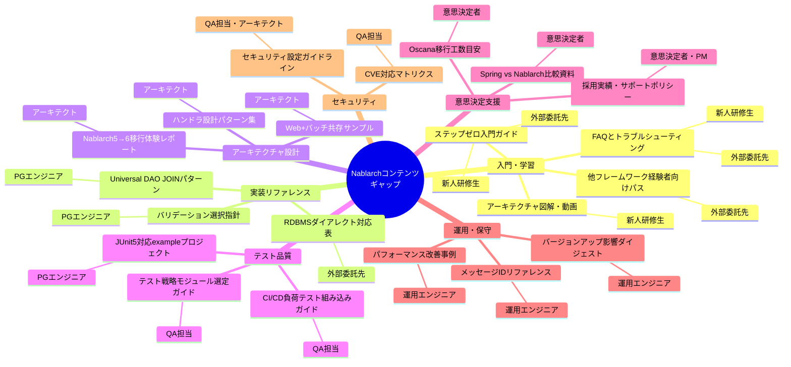

# Nablarch コンテンツ ギャップ分析

作成日: 2026-05-18

本文書は、[Phase 1コンテンツ調査](./official-content-inventory.md)および[Phase 2ユーザーストーリー仮説](./user-stories/)をもとに、ロール別のコンテンツニーズと現存コンテンツのギャップを分析したものです。

> **注記:** 本分析はコンテンツ調査と仮説ベースのユーザーストーリーから導出した仮説です。実際のユーザーリサーチによる検証を推奨します。

---

## ギャップ分析テーブル

| ロール | ニーズ | 現存コンテンツ | ギャップ（不足領域） | 投資優先度 |
|--------|--------|---------------|---------------------|------------|
| **アーキテクト/テックリード** | ハンドラキューのカスタム設計パターン | fintan.jp/page/14812/（1記事） | 汎用ハンドラ設計パターン集・複数ハンドラ連携テスト方法が皆無 | **High** |
| **アーキテクト/テックリード** | Web+バッチ共存プロジェクトの構成例 | nablarch-example（単体のみ） | Web＋バッチ共存のマルチモジュールpom.xmlサンプルが存在しない | **High** |
| **アーキテクト/テックリード** | Nablarch 5→6移行ガイド（既存コード移行） | nablarch-documentの移行ガイド（新規構築向け） | 既存コードベースの移行体験レポート・工数目安が皆無 | **High** |
| **プロジェクトマネージャー** | 採用実績・サポートポリシーの定量情報 | fintan.jp/page/1590/（開発プロセス紹介のみ） | 採用企業数・長期サポートポリシーの公式発表なし | **High** |
| **プロジェクトマネージャー** | 開発標準・成果物テンプレート集 | nablarch-system-development-guide（プロセス定義） | Officeドキュメント形式の成果物テンプレートがない | **Medium** |
| **プロジェクトマネージャー** | 学習ロードマップ・習得期間の目安 | nablarch-training（コンテンツのみ） | 想定学習時間・到達目標・ロードマップが未定義 | **Medium** |
| **PG/UT担当エンジニア** | Universal DAO JOINのEntityマッピング例 | nablarch-document（基本パターンのみ） | 複数テーブルJOINのEntity設計例が薄い | **High** |
| **PG/UT担当エンジニア** | バリデーション2系統の使い分けガイド | nablarch-document（各々の説明あり） | core-validation vs validation-ee の選択指針が不明確 | **High** |
| **PG/UT担当エンジニア** | JUnit 5 + nablarch-testing サンプルプロジェクト | nablarch-testing-junit5（モジュールのみ） | JUnit 5対応のexampleサンプルが存在しない | **High** |
| **保守・運用担当エンジニア** | エラーコード・メッセージID一覧 | nablarch-document（分散） | 一元化されたメッセージIDリファレンスがない | **High** |
| **保守・運用担当エンジニア** | バージョンアップ影響サマリ（運用目線） | リリースノート（詳細のみ） | 「この機能に影響あり/なし」の運用向けダイジェストがない | **Medium** |
| **保守・運用担当エンジニア** | パフォーマンス改善事例（Before/After） | nablarch-statistics-report（ツールのみ） | 実際のパフォーマンス改善事例・手順書がない | **Medium** |
| **技術選定意思決定者** | Spring Boot vs Nablarch 比較資料 | なし | 中立的なフレームワーク比較コンテンツが存在しない | **High** |
| **技術選定意思決定者** | Oscana移行ツールの変換率・工数目安 | fintan.jp/page/1452/（機能説明のみ） | 実プロジェクト移行工数・変換率の公開事例がない | **High** |
| **技術選定意思決定者** | Nablarch 6 + クラウド（EKS/K8s）事例 | Fintan 2021年事例（Fargate/Azure） | 最新（Java 21/Nablarch 6/Kubernetes）のクラウド事例がない | **Medium** |
| **新人研修生** | 「最初の1ステップ」明確な入門ガイド | nablarch-training（全体像のみ） | ステップゼロ（今日最初に何をするか）が不明確 | **High** |
| **新人研修生** | アーキテクチャ図解・ビジュアル解説 | nablarch-document（テキスト中心） | ハンドラキュー等の図解・動画コンテンツがゼロ | **High** |
| **新人研修生** | Nablarch FAQとトラブルシューティング集 | なし | 「よくあるエラーと解決策」が公式・非公式ともに存在しない | **High** |
| **外部委託先エンジニア** | 他フレームワーク経験者向け入門パス | なし | 「Spring経験者がNablarchに入門するためのガイド」がない | **High** |
| **外部委託先エンジニア** | 非公開APIチェッカーの修正ガイド | nablarch-unpublished-api-checker（ツールのみ） | 「検出されたらこう直す」の具体的修正ガイドがない | **Medium** |
| **外部委託先エンジニア** | RDBMSごとのDialect対応表 | なし（MySQLはQiita記事1件のみ） | 主要RDBMS（MySQL/MariaDB/TiDB）のDialect対応表がない | **Medium** |
| **QA担当** | テストモジュール組み合わせパターン集 | 各モジュールのREADMEのみ | テスト戦略・モジュール選定ガイドが一元化されていない | **High** |
| **QA担当** | 負荷テストのCI/CD組み込みガイド | Qiita記事1件（ローカル実行のみ） | GitHub Actions等でのKarate/Gatling自動化手順がない | **Medium** |
| **QA担当** | CVE・セキュリティアドバイザリ一覧 | JVN/GitHub Advisory（分散） | バージョン×CVE対応マトリクスが整備されていない | **High** |

---

## 優先度集計

| 投資優先度 | 件数 |
|-----------|------|
| **High** | 15件 |
| **Medium** | 9件 |
| **Low** | 0件 |

---

## 全体像俯瞰（Mermaid マインドマップ）

---

## 投資優先度の考え方

### High優先度の選定基準

以下の条件を1つ以上満たすギャップを **High** と判定した:

1. **複数ロールに影響する**: 2つ以上のロールがそのギャップによる不便を訴えている
2. **既存コンテンツが完全不在**: 代替となる公式・非公式コンテンツがゼロ
3. **プロジェクト採用障壁になる**: 意思決定者や入門者が離脱する可能性が高い

### 最優先対応候補（Top 5）

| 優先 | ギャップ | 理由 |
|------|---------|------|
| 1 | Nablarch FAQとトラブルシューティング集 | 新人・外部委託先の共通ニーズ。現在ゼロ。離脱防止効果大 |
| 2 | アーキテクチャ図解・ビジュアル解説（動画含む） | 入門コスト削減。YouTube等で低コスト提供可能 |
| 3 | Spring Boot vs Nablarch 比較資料 | 技術選定段階での採用障壁を下げる。意思決定者の直接ニーズ |
| 4 | JUnit 5 + nablarch-testing サンプルプロジェクト | 実装エンジニアの日常業務を直接支援。既存exampleと同形式で提供可能 |
| 5 | 他フレームワーク経験者向け入門パス | SIer案件増加でNablarch初経験者の流入増が予想される |
